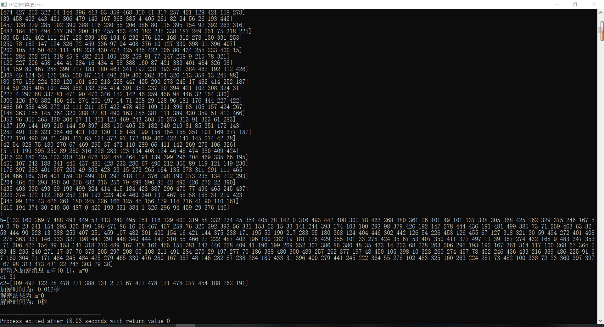

# 这个寒假都发生了什么呢？  

#### 新型冠状病毒爆发，年后就通告全面封村了，只能在家里，不能出去玩。打完工挣来的钱也花不了了。

### 虽然一直呆在家里，但我还是做了很多算是有意义的事情吧。
#### 因为开学的延迟，英语老师发布了口语任务，，于是我就开始了长达数周的英语打卡，每天和机器英语较劲还是挺有意思的。

#### 兹2.14发生了一件很有趣很重要的事情，这是寒假以来最开心的一天吧，我想我不会忘记，但还是在这里留下一个记忆点。

#### 兹2.15我的第一个长达100行，近3000字的c++加密程序完成，很开心，下面继续优化。
  
#### [放我回去，我还要看！][1]
[1]: index.md
